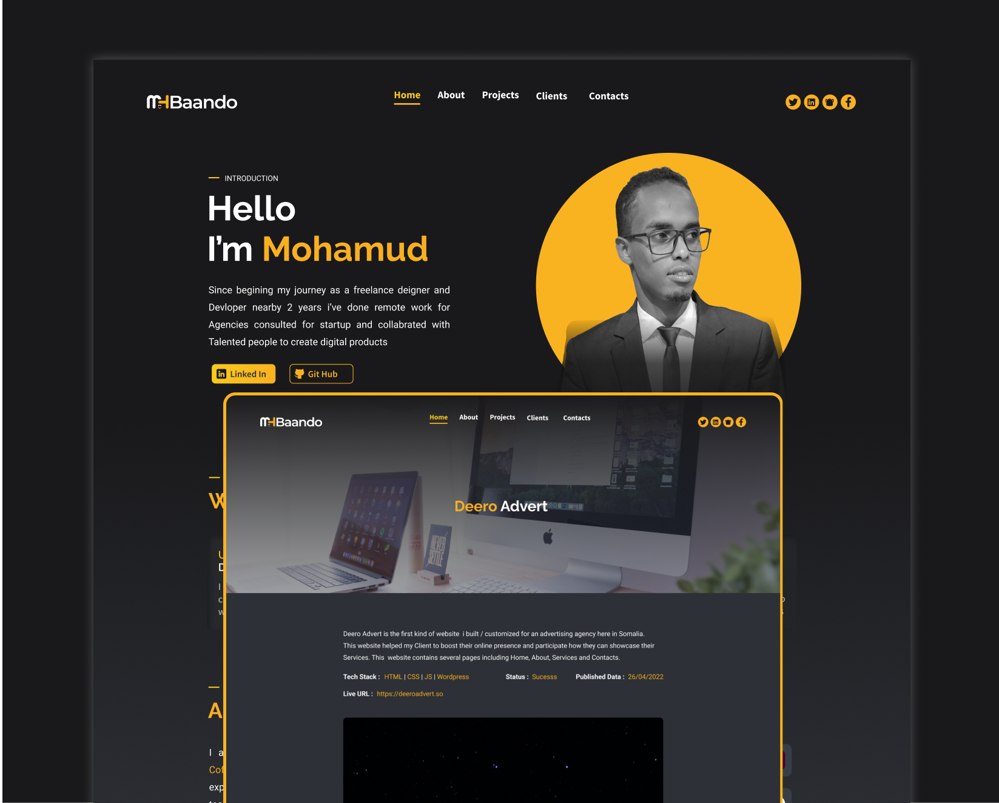

# ✅ About Me

i am Mohamud Abshir , I am a professional Front-End developer, with almost
`2 years` of experience in developing and designing web applications, landing
pages, personal sites, corporate websites, and so on using various technologies
such us `HTML`,`CSS`,`JavaScript`,`React`,
`Angular`,`Node js`,`SCSS`,`Bootstrap`. also i develop websites using no code
platforms such us `webflow` &`wordpress` also i am a `UI/UX` designer with
background of `Graphic Design`, `llustrations`,`2D animations` and a little bit
of`Digital Marketing`

`Please dont Hesitate to contact me if you have a project i can contribute`

---

## Strapi Backend

This repo is the strapi back-end that powers my personal portfolio website, incase you didn't visit [My website](https://mhbaando.com).

### Strapi supports my website

Strapi porvides to my wesbite a palce that i can dynamically store [My Recent Porjects](https://mhbaando.com/projects), My Cliens and Thier Testimonial.

---

## Please follow Me on Mysocial

please also check my social networks with this tag`mhbaando`

- <https://www.facebook.com/mhbaando>
- <https://www.instagram.com/mhbaando>
- <https://www.linkedin.com/in/mhbaando>
- <https://www.twitter.com/mhbaando>

## 📸 Here are some screen shots

---

